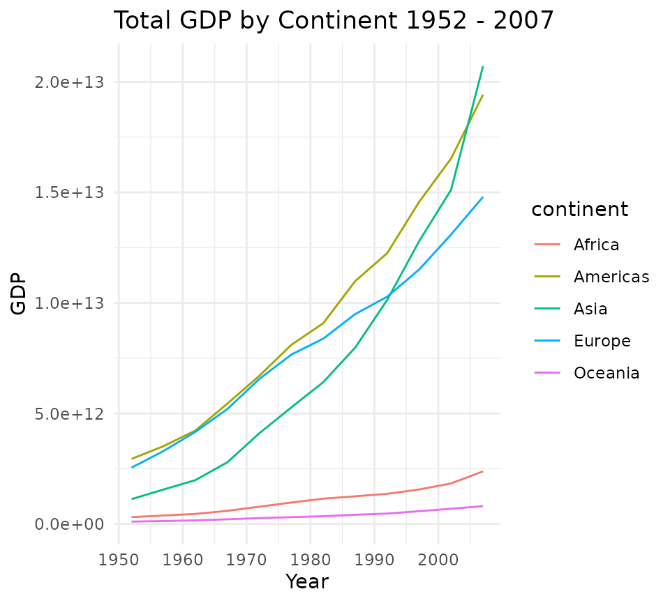

# Benchmark

## Introduction

The vignette benchmarks `plotjs` against various other plotting systems
for R, namely `plotly`. Two basic plots will be used for this benchmark,
a basic scatter plot and a grouped line plot. I am uncertain if
JavaScript execution time is counted by `microbenchmark`. Even if we
assume it isn’t, the benchmark results are informative because it’s
always better if the R process gets tied up for less time per plot.
First, let’s load the visualization packages to compare:

``` r
library(plotjs)
library(plotly)
#> Loading required package: ggplot2
#> 
#> Attaching package: 'plotly'
#> The following object is masked from 'package:ggplot2':
#> 
#>     last_plot
#> The following object is masked from 'package:stats':
#> 
#>     filter
#> The following object is masked from 'package:graphics':
#> 
#>     layout
library(ggplot2)
```

## Scatter Plot

First, we will benchmark the creation of simple scatter plots using data
from the `gapminder` package. To begin, we will define functions to
create similar scatterplots using each of the packages to be compared.
The plots themselves are not important but are shown to demonstrate that
they work and produce roughly similar plots.

``` r
library(gapminder)

gapminder <- gapminder

plot_base <- function(x){
  
  plot(x = x$gdpPercap, y = x$lifeExp)
}

plot_base(gapminder)
```


``` r
plot_plotjs <- function(x){
 
  plotjs(x = x$gdpPercap, y = x$lifeExp, sci.x = TRUE)
}
plot_plotjs(gapminder)
```

``` r
plot_plotly <- function(x){
  plot_ly(data = x, x = ~gdpPercap, y = ~lifeExp, type = "scatter")
}
plot_plotly(gapminder)
#> No scatter mode specifed:
#>   Setting the mode to markers
#>   Read more about this attribute -> https://plotly.com/r/reference/#scatter-mode
```

``` r
plot_ggplotly <- function(x){
  g <- ggplot(x, aes(x = gdpPercap, y = lifeExp)) + geom_point() + theme_minimal()
  ggplotly(g)
}
plot_ggplotly(gapminder)
```

``` r
plot_ggplot <- function(x){
  ggplot(x, aes(x = gdpPercap, y = lifeExp)) + geom_point() + theme_minimal()
}
plot_ggplot(gapminder)
```


Now, these functions are benchmarked:

``` r
library(microbenchmark)
m <- microbenchmark(base = plot_base(gapminder),
               plotjs = plot_plotjs(gapminder),
               plotly = plot_plotly(gapminder),
               ggplotly = plot_ggplotly(gapminder),
               ggplot = plot_ggplot(gapminder),
               unit = "ms",
               times = 50)
```

``` r
m
#> Unit: milliseconds
#>      expr        min         lq        mean      median         uq        max
#>      base  23.508016  60.621858  60.2903546  60.9903110  61.192133  64.427534
#>    plotjs   0.075250   0.109985   0.1453943   0.1198635   0.126226   1.577395
#>    plotly   0.341137   0.397171   0.5024155   0.4828420   0.538696   2.037575
#>  ggplotly 161.898338 167.702316 175.2347867 174.6228585 181.219607 202.676964
#>    ggplot  32.980213  35.963193  40.3687412  37.7839380  40.654944 151.248403
#>  neval
#>     50
#>     50
#>     50
#>     50
#>     50
```

On my main development machine, plotjs was the quickest by an order of
magnitude. This can vary, but `plotly` is roughly 20 times slower, and
[`ggplotly()`](https://rdrr.io/pkg/plotly/man/ggplotly.html) is hundreds
of times slower. However, `plotly` was still quick enough that the
performance difference with `plotjs` would be imperceptible to users.

``` r
plot(m)
```


Let’s look at kernel density plots of the time distributions for
`plotjs` and `plotly`.

``` r
density_plotjs <- density(m$time[m$expr == "plotjs"])
plotjs(density_plotjs)
```

``` r
density_plotly <- density(m$time[m$expr == "plotly"])
plotjs(density_plotly)
```

Let’s use a two-sample Wilcoxon test to compare the means of execution
time for plotjs and plotly. A t-test would not be suitable because we
cannot assume normality. The null hypothesis is that `plotjs` and
`plotly` will have the same mean execution time for these scatter plots.

``` r
w <- wilcox.test(m$time[m$expr == "plotjs"],
                 m$time[m$expr == "plotly"],
                 alternative = "less",
                 paired = FALSE)
w
#> 
#>  Wilcoxon rank sum test with continuity correction
#> 
#> data:  m$time[m$expr == "plotjs"] and m$time[m$expr == "plotly"]
#> W = 49, p-value < 2.2e-16
#> alternative hypothesis: true location shift is less than 0
```

Can we reject the null hypothesis?

``` r
ifelse(w$p.value < .05, "yes", "no")
#> [1] "yes"
```

## Grouped Line plots

Making line plots colored by group is a common plotting task that could
potentially expose some slowness in `plotjs`. We will make line plots of
the total GDP by continent by year. First, we must summarize the data
and define functions for making this lineplot with various packages.

``` r
library(dplyr)
#> 
#> Attaching package: 'dplyr'
#> The following objects are masked from 'package:stats':
#> 
#>     filter, lag
#> The following objects are masked from 'package:base':
#> 
#>     intersect, setdiff, setequal, union
gdp_cont <- gapminder %>%
  mutate(gdp = pop * gdpPercap) %>%
  group_by(continent, year) %>%
  summarize(total_gdp = sum(gdp))
#> `summarise()` has regrouped the output.
#> ℹ Summaries were computed grouped by continent and year.
#> ℹ Output is grouped by continent.
#> ℹ Use `summarise(.groups = "drop_last")` to silence this message.
#> ℹ Use `summarise(.by = c(continent, year))` for per-operation grouping
#>   (`?dplyr::dplyr_by`) instead.

plot_title <- "Total GDP by Continent 1952 - 2007"
```

``` r
plotjs_line <- function(x){
  plotjs(x$year, x$total_gdp, col.group = x$continent, sci.y = TRUE, 
         type = "l", main = plot_title, xlab = "Year", ylab = "GDP",
         legend.title = "Continent")
}

plotjs_line(gdp_cont)
```

``` r
ggplot_line <- function(x){
  ggplot(x, aes(x = year, y = total_gdp, col = continent, group = continent)) +
    geom_line() +
    theme_minimal() +
    labs(title = plot_title, x = "Year", y = "GDP")
}
ggplot_line(gdp_cont)
```



``` r
ggplotly_line <- function(x){
  p <- ggplot(x, aes(x = year, y = total_gdp, col = continent)) +
    geom_line() +
    theme_minimal() +
    labs(title = plot_title, x = "Year", y = "GDP")
  ggplotly(p)
}

ggplotly_line(gdp_cont)
```

``` r
plotly_line <- function(x){
  plot_ly(data = x, x = ~year, y = ~total_gdp, split = ~continent,
          type = "scatter", color  = ~continent, mode = "lines")
}
plotly_line(gdp_cont)
```

Now let’s benchmark these line plot functions:

``` r
m2 <- microbenchmark(plotjs = plotjs_line(gdp_cont),
                     ggplotly = ggplotly_line(gdp_cont),
                     plotly = plotly_line(gdp_cont),
                     ggplot = ggplot_line(gdp_cont),
                     unit = "ms",
                     times = 50)
```

``` r
m2
#> Unit: milliseconds
#>      expr        min         lq        mean     median         uq        max
#>    plotjs   0.443618   0.476410   0.5665169   0.538295   0.574302   2.394361
#>  ggplotly 170.797857 174.425521 182.0984151 179.299632 182.213273 310.639590
#>    plotly   0.356165   0.409886   0.5467231   0.437146   0.476590   3.824962
#>    ggplot  34.382742  35.403167  37.5157257  36.665545  39.163409  43.799435
#>  neval
#>     50
#>     50
#>     50
#>     50
```

``` r
plot(m2)
```


Let’s perform the same test as before:

``` r
w2 <- wilcox.test(m2$time[m2$expr == "plotjs"],
                 m2$time[m2$expr == "plotly"],
                 alternative = "less",
                 paired = FALSE)
w2
#> 
#>  Wilcoxon rank sum test with continuity correction
#> 
#> data:  m2$time[m2$expr == "plotjs"] and m2$time[m2$expr == "plotly"]
#> W = 2094.5, p-value = 1
#> alternative hypothesis: true location shift is less than 0
```

Can we reject the null hypothesis that plotjs and plotly have the same
mean?

``` r
ifelse(w2$p.value < .05, "yes", "no")
#> [1] "no"
```

## Conclusions

Although benchmark results will vary on different systems, the results
on my development machine indicate that plotjs is faster than plotly
(and others) for both the scatter plot and grouped line plot tested.
Although statistically significant, the difference in performance
between plotjs and plotly would almost certainly never be perceptible to
users.

Both plotjs and direct use of plotly potentially offer perceptible
performance improvements over using
[`ggplotly()`](https://rdrr.io/pkg/plotly/man/ggplotly.html) to generate
interactive visualizations. Shiny developers may find this information
useful.
